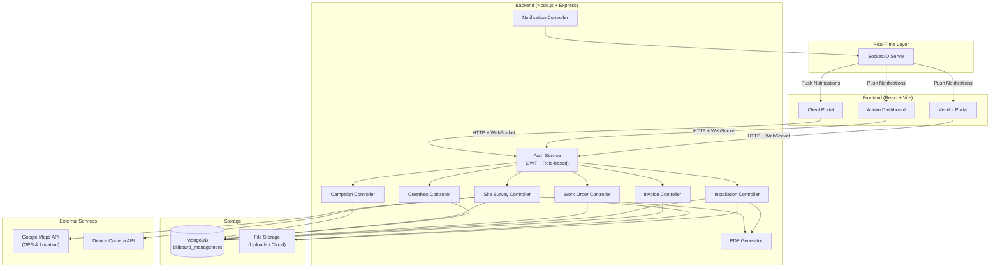
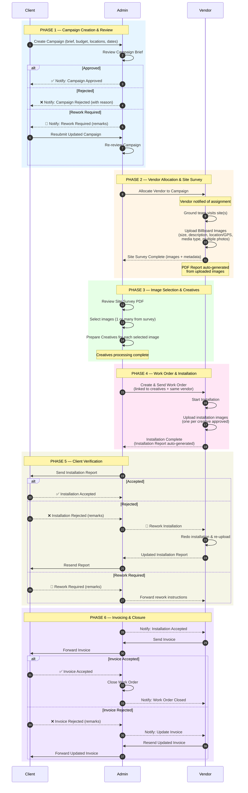
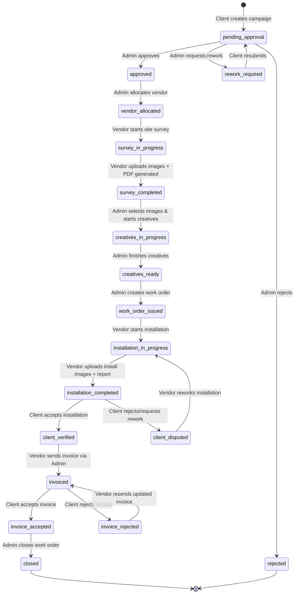
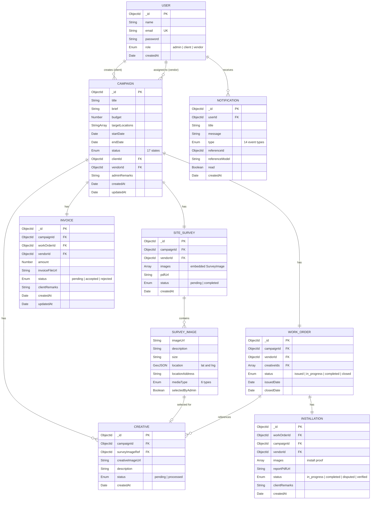
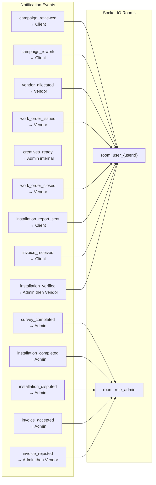

# Billboard Management System — Architecture & Design

## Table of Contents
- [1. High-Level Architecture](#1-high-level-architecture)
- [2. Roles](#2-roles)
- [3. Complete Callflow (6 Phases)](#3-complete-callflow-6-phases)
- [4. Campaign State Machine](#4-campaign-state-machine)
- [5. Data Model (ER Diagram)](#5-data-model-er-diagram)
- [6. Notification Events](#6-notification-events)
- [7. API Endpoints](#7-api-endpoints)
- [8. Tech Stack](#8-tech-stack)

---

## 1. High-Level Architecture

---

## 2. Roles

| Role | Responsibilities |
|------|-----------------|
| **Client** | Creates campaigns, reviews installation reports, approves/rejects invoices |
| **Admin** | Reviews campaigns, allocates vendors, selects billboard images, creates work orders, manages creatives, forwards reports/invoices |
| **Vendor** | Conducts site surveys (uploads geotagged billboard photos), performs installations, uploads installation images, sends invoices |

---

## 3. Complete Callflow (6 Phases)

### Phase Summary

| Phase | Key Actions |
|-------|------------|
| **1. Campaign Creation & Review** | Client creates → Admin approves/rejects/rework |
| **2. Vendor Allocation & Site Survey** | Admin assigns vendor → Vendor visits sites, uploads geotagged billboard photos → PDF auto-generated |
| **3. Image Selection & Creatives** | Admin selects images from survey → Prepares creatives for each |
| **4. Work Order & Installation** | Admin creates work order → Same vendor installs → Uploads proof images → Report generated |
| **5. Client Verification** | Admin sends report → Client accepts/rejects/rework |
| **6. Invoicing & Closure** | Vendor invoices → Admin forwards → Client accepts/rejects → Admin closes work order |

---

## 4. Campaign State Machine

**17 states** covering the full lifecycle:

### Status Transitions Table

| From | To | Triggered By | Action |
|------|----|-------------|--------|
| — | `pending_approval` | Client | Create campaign |
| `pending_approval` | `approved` | Admin | Approve campaign |
| `pending_approval` | `rejected` | Admin | Reject campaign |
| `pending_approval` | `rework_required` | Admin | Request rework (with remarks) |
| `rework_required` | `pending_approval` | Client | Resubmit updated campaign |
| `approved` | `vendor_allocated` | Admin | Allocate vendor |
| `vendor_allocated` | `survey_in_progress` | Vendor | Start site survey |
| `survey_in_progress` | `survey_completed` | Vendor | Upload images (PDF auto-generated) |
| `survey_completed` | `creatives_in_progress` | Admin | Select images, begin creatives |
| `creatives_in_progress` | `creatives_ready` | Admin | Finish creatives |
| `creatives_ready` | `work_order_issued` | Admin | Create work order |
| `work_order_issued` | `installation_in_progress` | Vendor | Start installation |
| `installation_in_progress` | `installation_completed` | Vendor | Upload install images + report |
| `installation_completed` | `client_verified` | Client | Accept installation |
| `installation_completed` | `client_disputed` | Client | Reject/rework installation |
| `client_disputed` | `installation_in_progress` | Vendor | Redo installation |
| `client_verified` | `invoiced` | Vendor | Send invoice |
| `invoiced` | `invoice_accepted` | Client | Accept invoice |
| `invoiced` | `invoice_rejected` | Client | Reject invoice (with remarks) |
| `invoice_rejected` | `invoiced` | Vendor | Resend updated invoice |
| `invoice_accepted` | `closed` | Admin | Close work order |

---

## 5. Data Model (ER Diagram)

### Media Types (for Survey Images)
| Value | Display Name |
|-------|-------------|
| `vinyl` | Vinyl |
| `one_way` | One Way |
| `sunboard` | Sunboard |
| `no_lit_board` | No-Lit Board |
| `glow_sign_board` | Glow Sign Board |
| `acrylic_board` | Acrylic Board |

---

## 6. Notification Events

### Notification Events Detail

| # | Event | Recipient | Trigger |
|---|-------|-----------|---------|
| 1 | `campaign_reviewed` | Client | Admin approves or rejects campaign |
| 2 | `campaign_rework` | Client | Admin requests campaign rework |
| 3 | `vendor_allocated` | Vendor | Admin assigns vendor to campaign |
| 4 | `survey_completed` | Admin | Vendor completes site survey |
| 5 | `creatives_ready` | Admin (internal) | Creatives processing finished |
| 6 | `work_order_issued` | Vendor | Admin creates work order |
| 7 | `installation_completed` | Admin | Vendor finishes installation |
| 8 | `installation_report_sent` | Client | Admin forwards installation report |
| 9 | `installation_verified` | Admin → Vendor | Client accepts installation |
| 10 | `installation_disputed` | Admin | Client rejects installation |
| 11 | `invoice_received` | Client | Admin forwards invoice |
| 12 | `invoice_accepted` | Admin | Client accepts invoice |
| 13 | `invoice_rejected` | Admin → Vendor | Client rejects invoice |
| 14 | `work_order_closed` | Vendor | Admin closes work order |

---

## 7. API Endpoints

| Resource | Method | Endpoint | Role | Description |
|----------|--------|----------|------|-------------|
| **Auth** | POST | `/api/auth/register` | Public | Register user |
| **Auth** | POST | `/api/auth/login` | Public | Login, returns JWT |
| **Campaign** | POST | `/api/campaigns` | Client | Create new campaign |
| **Campaign** | GET | `/api/campaigns` | All | List campaigns (filtered by role) |
| **Campaign** | GET | `/api/campaigns/:id` | All | Get campaign details |
| **Campaign** | PUT | `/api/campaigns/:id` | Client | Update campaign (resubmit) |
| **Campaign** | PATCH | `/api/campaigns/:id/review` | Admin | Approve/reject/rework campaign |
| **Campaign** | PATCH | `/api/campaigns/:id/allocate-vendor` | Admin | Assign vendor |
| **Site Survey** | POST | `/api/site-surveys` | Vendor | Create survey with images |
| **Site Survey** | GET | `/api/site-surveys/:campaignId` | Admin, Vendor | Get survey for campaign |
| **Site Survey** | PATCH | `/api/site-surveys/:id/select-images` | Admin | Select images from survey |
| **Creative** | POST | `/api/creatives` | Admin | Create creative from selected image |
| **Creative** | GET | `/api/creatives/:campaignId` | Admin, Vendor | List creatives for campaign |
| **Creative** | PATCH | `/api/creatives/:id` | Admin | Update creative status |
| **Work Order** | POST | `/api/work-orders` | Admin | Create work order |
| **Work Order** | GET | `/api/work-orders/:id` | Admin, Vendor | Get work order details |
| **Work Order** | PATCH | `/api/work-orders/:id/close` | Admin | Close work order |
| **Installation** | POST | `/api/installations` | Vendor | Start installation + upload images |
| **Installation** | GET | `/api/installations/:workOrderId` | All | Get installation details |
| **Installation** | PATCH | `/api/installations/:id/verify` | Client | Accept/reject/rework installation |
| **Invoice** | POST | `/api/invoices` | Vendor | Create invoice |
| **Invoice** | GET | `/api/invoices/:campaignId` | All | Get invoice for campaign |
| **Invoice** | PATCH | `/api/invoices/:id/review` | Client | Accept/reject invoice |
| **Invoice** | PUT | `/api/invoices/:id` | Vendor | Update rejected invoice |
| **Notification** | GET | `/api/notifications` | All | Get user's notifications |
| **Notification** | PATCH | `/api/notifications/:id/read` | All | Mark notification as read |

---

## 8. Tech Stack

| Layer | Technology |
|-------|-----------|
| Frontend | React 18 + Vite |
| UI Components | Tailwind CSS / Material UI |
| State Management | React Context / Zustand |
| Backend | Node.js + Express |
| Database | MongoDB + Mongoose |
| Authentication | JWT (JSON Web Tokens) |
| Real-Time | Socket.IO |
| File Uploads | Multer (local) / Cloud Storage |
| PDF Generation | PDFKit / Puppeteer |
| Maps & GPS | Google Maps JavaScript API |
| Camera | HTML5 MediaDevices API |
